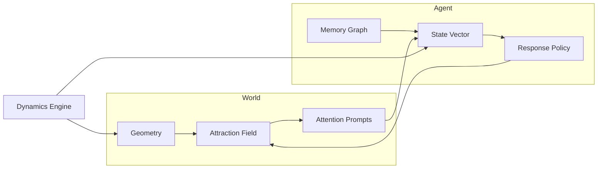

# Architecture

This document describes a technical architecture for a Rust-based AI/ML simulation
framework that models synthetic consciousness primitives: atomic geometry, attraction,
statefulness, and perpetual velocity. The system is a dynamical multi-agent field with
memory, attention, and feedback.

## Design Objectives

- Represent micro-interactions between entities as atomic events.
- Encode attention as an attraction field over geometry.
- Preserve state over time with decay, redundancy, and long-term memory.
- Enforce perpetual velocity to avoid static equilibria.
- Provide a deterministic and reproducible simulation core.
- Enable ML-style experiments: ablations, parameter sweeps, and metrics.

## Core Entities

### Entity (Agent)

Minimal interacting unit with geometry, state, and response policy.

- `id`: stable identity
- `pose`: position + orientation in geometry (2D or 3D)
- `velocity`: direction and magnitude of motion
- `state`: memory graph, belief clusters, context stack, traits
- `essence_index`: well-being scalar (0–10)
- `baseline_drives`: (self-preservation, curiosity)
- `policy`: response function

### Attraction Field

Spatially defined attraction and valence potentials that generate attention.

- $\Phi_i(x, t)$: attraction scalar or vector field per entity
- $F_i(x, t)$: attention prompt (gradient of potential)
- Kernel functions: Gaussian, inverse-distance, or custom

### Memory Graph with Belief Clusters

Statefulness captured as a directed graph of experiences with decay but no deletion.

- Nodes: memory events with activation, timestamp, and cluster assignment
- Edges: causal or temporal links
- Redundancy: low-activation nodes persist as dormant memories
- Belief clusters: semantic groupings (religion, love, morality, ideology, experience valence)
- Affective signals: per-cluster valence aggregates

### Dynamics Engine

Perpetual velocity ensures continuous motion and interaction updates.

- Integrator: Euler / Semi-implicit / RK4 (configurable)
- Time step: fixed $\Delta t$
- Velocity floor: $\epsilon > 0$ minimal speed injection

## Mathematical Model

### Geometry and Attraction

Let $x_i \in \mathbb{R}^d$ be the position of entity $i$ where $d \in \{2, 3\}$, supporting
both 2D planar and 3D volumetric simulations.

Attraction potential:

$$
\Phi_i(x, t) = \sum_{j \neq i} w_{ij} \cdot K(\|x - x_j\|, \sigma_{ij})
$$

where $K$ is a kernel such as Gaussian or inverse-distance.

Attraction force (attention prompt):

$$
F_i(x, t) = -\nabla_x \Phi_i(x, t)
$$

### Statefulness and Memory

Let $s_i(t)$ be a state vector. Update is driven by attention and memory decay.

$$
s_i(t + \Delta t) = \alpha s_i(t) + \beta \cdot g(F_i, \text{context}_i) + \gamma \cdot m_i
$$

where $m_i$ is a memory projection from the graph, and $0 < \alpha < 1$ is a decay
factor (redundancy without deletion).

#### Belief Clustering

Memory is organized into semantic belief clusters reflecting religion, love, friendship,
morality, philosophy, ideology, and experience valence (good/bad). Each new memory node
is assigned to clusters based on semantic similarity:

$$
\text{similarity}(e_i, B_k) = \frac{1}{|B_k|}\sum_{j \in B_k} \frac{e_i \cdot m_j}{\|e_i\| \|m_j\|} > \tau
$$

#### Affective Signals

Each belief cluster $B_k$ emits an affective signal:

$$
\sigma_k = \sum_{j \in B_k} w_j \cdot \rho_j \cdot v_j
$$

where $w_j$ is cluster membership weight, $\rho_j$ is node activation, and $v_j \in \{-1, 0, +1\}$
is valence (feel-bad, neutral, feel-good).

#### Essence Index

A scalar metric (0–10) tracking overall life satisfaction and well-being:

$$
E_i(t) = 5 + \frac{1}{K} \sum_{k=1}^K w_k \cdot \sigma_k(t)
$$

Essence Index influences response decisiveness:

$$
\text{influence}_{\text{essence}} = 2 \cdot |E_i(t) - 5|
$$

Essence decays toward baseline:

$$
E_i(t + \Delta t) = E_i(t) + (5 - E_i(t)) \cdot \tau_{\text{decay}} + \delta_{\text{experience}}
$$

#### Baseline Drives

Self-preservation and curiosity emerge as default instincts:

$$
\text{drive}_{\text{preserve}} = \frac{1}{\min_j \|x_i - x_j\|}
$$

$$
\text{drive}_{\text{curiosity}} = \|F_i\|
$$

#### Affective-Driven Response Behavior

Response is determined by the dominant affective signal at decision time:

$$
\text{response}_d = \arg\max_k \sigma_k
$$

This manifests across behavioral dimensions:

- **Truth vs. Lie:** Honesty vs. deception clusters compete
- **Civility vs. Unruliness:** Social cooperation vs. aggression
- **Good vs. Evil:** Moral drives vs. self-preservation

Responses depend on accumulated statefulness; entities with positive histories tend toward
civility and honesty, while those with trauma histories may favor deception or unruliness
when competing signals are weak.

### Perpetual Velocity

Velocity is prevented from collapsing to zero using a floor or energy injection:

$$
v_i(t + \Delta t) = v_i(t) + \Delta t \cdot a_i(t) + \epsilon \cdot \hat{v}_i
$$

where $\hat{v}_i$ is the unit direction of motion and $\epsilon > 0$ is the minimal
velocity injection.

## System Flow

1. Compute attraction field from geometry and current state.
2. Derive attention prompts from attraction gradients.
3. Update memory graph, cluster new experiences into belief clusters.
4. Update affective signals for each belief cluster.
5. Compute Essence Index from aggregated affective signals.
6. Calculate baseline drives (self-preservation, curiosity).
7. Generate responses based on dominant affective signals and Essence Index.
8. Update state vectors and Essence Index with decay toward baseline.
9. Apply responses to generate new attractions.
10. Integrate motion with perpetual velocity enforcement.
11. Emit metrics and trace events.

## Architecture Diagram



## Data Model (Rust)

```rust
pub type EntityId = u64;

#[derive(Clone, Debug)]
pub struct Pose {
    pub position: [f32; 3],    // or [f32; 2] for 2D
    pub orientation: [f32; 4],
}

#[derive(Clone, Debug)]
pub struct BeliefCluster {
    pub id: u32,
    pub nodes: Vec<usize>,     // indices into memory graph nodes
    pub affective_signal: f32, // -5.0 to +5.0
    pub weight: f32,
}

#[derive(Clone, Debug)]
pub struct EntityState {
    pub memory: Vec<f32>,
    pub context: Vec<f32>,
    pub traits: Vec<f32>,
    pub essence_index: f32,    // 0.0 to 10.0
    pub belief_clusters: Vec<BeliefCluster>,
}

#[derive(Clone, Debug)]
pub struct Entity {
    pub id: EntityId,
    pub pose: Pose,
    pub velocity: [f32; 3],    // or [f32; 2] for 2D
    pub state: EntityState,
    pub baseline_drives: (f32, f32), // (preservation, curiosity)
}
```

## Dynamics Engine (Rust)

```rust
pub struct DynamicsConfig {
	pub dt: f32,
	pub min_speed: f32,
	pub damping: f32,
}

pub fn integrate(
	position: &mut [f32; 3],
	velocity: &mut [f32; 3],
	acceleration: [f32; 3],
	cfg: &DynamicsConfig,
) {
	// Apply acceleration
	for i in 0..3 {
		velocity[i] = (velocity[i] + cfg.dt * acceleration[i]) * cfg.damping;
	}

	// Enforce perpetual velocity
	let speed = (velocity[0] * velocity[0]
		+ velocity[1] * velocity[1]
		+ velocity[2] * velocity[2])
		.sqrt();
	if speed < cfg.min_speed {
		let inv = if speed > 0.0 { 1.0 / speed } else { 1.0 };
		for i in 0..3 {
			velocity[i] = velocity[i] * inv * cfg.min_speed;
		}
	}

	// Update position
	for i in 0..3 {
		position[i] += cfg.dt * velocity[i];
	}
}
```

## Attraction Field (Rust)

```rust
pub fn attraction_force(
	position: [f32; 3],
	others: &[[f32; 3]],
	weights: &[f32],
	sigma: f32,
) -> [f32; 3] {
	let mut force = [0.0_f32; 3];
	let sigma2 = sigma * sigma;

	for (idx, p) in others.iter().enumerate() {
		let dx = [position[0] - p[0], position[1] - p[1], position[2] - p[2]];
		let r2 = dx[0] * dx[0] + dx[1] * dx[1] + dx[2] * dx[2];
		let k = (-r2 / (2.0 * sigma2)).exp();
		let w = weights.get(idx).copied().unwrap_or(1.0);
		force[0] += -dx[0] * w * k;
		force[1] += -dx[1] * w * k;
		force[2] += -dx[2] * w * k;
	}

	force
}
```

## Memory Graph Sketch

```rust
#[derive(Clone, Debug)]
pub struct MemoryNode {
    pub event: Vec<f32>,
    pub activation: f32,
    pub timestamp: u64,
    pub cluster_id: Option<u32>,  // assigned belief cluster
}

#[derive(Default, Debug)]
pub struct MemoryGraph {
    pub nodes: Vec<MemoryNode>,
    pub edges: Vec<(usize, usize)>,
}

impl MemoryGraph {
    pub fn decay(&mut self, factor: f32) {
        for node in &mut self.nodes {
            node.activation *= factor;
        }
    }

    pub fn cluster_similarity(
        event: &[f32],
        cluster_nodes: &[usize],
        nodes: &[MemoryNode],
    ) -> f32 {
        if cluster_nodes.is_empty() {
            return 0.0;
        }
        let mut total = 0.0;
        for &idx in cluster_nodes {
            if let Some(node) = nodes.get(idx) {
                let dot = event.iter()
                    .zip(&node.event)
                    .map(|(a, b)| a * b)
                    .sum::<f32>();
                let event_norm = event.iter().map(|x| x * x).sum::<f32>().sqrt();
                let node_norm = node.event.iter().map(|x| x * x).sum::<f32>().sqrt();
                if event_norm > 0.0 && node_norm > 0.0 {
                    total += dot / (event_norm * node_norm);
                }
            }
        }
        total / cluster_nodes.len() as f32
    }
}
```

## Metrics and Evaluation

- **Attention entropy:** Dispersion of attraction over neighbors
  $$H_A = - \sum_j \pi_{i \to j} \log \pi_{i \to j}$$

- **Memory diversity:** Activation spread across graph nodes
  $$D_M = 1 - \sum_k p_k^2$$

- **Velocity stability:** Ratio of steps above minimum speed
  $$S_V = \frac{1}{T} \sum_{t=1}^T \mathbb{I}[\|v_i(t)\| \ge v_{min}]$$

- **Identity coherence:** Similarity of state across time windows
  $$C_I = \frac{1}{T} \sum_{t=1}^T \frac{s_i(t) \cdot s_i(t-\tau)}{\|s_i(t)\|\|s_i(t-\tau)\|}$$

- **Belief cluster stability:** Intra-cluster semantic coherence
  $$B_{\text{stability}} = \frac{1}{K} \sum_{k=1}^K \frac{1}{|B_k|^2} \sum_{i,j \in B_k} \text{similarity}(e_i, e_j)$$

- **Affective signal strength:** Mean magnitude of dominant signals
  $$\sigma_{\text{strength}} = \frac{1}{T} \sum_{t=1}^T \max_k |\sigma_k(t)|$$

- **Essence Index trajectory:** Mean, variance, and extremity
  $$E_{\text{mean}}, E_{\text{variance}}, E_{\text{extremity}} = |E_i(t) - 5|$$

## Future Work

- Implement learned response policies using neural networks to compare against deterministic baselines.
- Add multi-scale geometry and hierarchical memory for complex belief structures.
- Introduce observation models for partial perception and imperfect sensing.
- Develop visualization tools for real-time attention dynamics, memory evolution, and essence tracking.
- Support for distributed simulation across multiple nodes.
- Extended statefulness documentation and specialized applications.

## References

For complete mathematical derivations, full equations, and experimental protocols, see:
- [Technical Whitepaper](./whitepaper.md)
- [README](./README.md)
